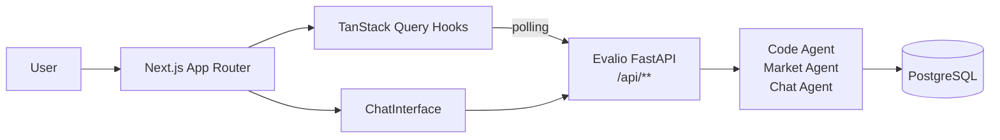

<div align="center">
  <h1 style="margin-bottom: 0.25rem;">Evalio Frontend</h1>
  <p style="margin-top: 0; color: #6b7280;">Public-facing dashboard for the Evalio hackathon evaluation platform.</p>
  <p>
    
    
    
  </p>
  <p>
    
    
    
  </p>
</div>

---

## Overview

Evalio Frontend is the participant-facing interface of the Evalio platform. Organizers create hackathons with custom criteria, participants submit projects via GitHub link, and everyone follows AI-driven evaluations as they run — wrapped in a neo-brutalist design.

- 🏆 **Hackathon dashboard** — browse and create hackathons with custom evaluation criteria.
- 📦 **Project submission** — GitHub link, description, and project type; triggers async AI analysis in the background.
- 🔄 **Live polling** — project page auto-refreshes while agents are running, settles once results land.
- 🤖 **AI results** — per-criterion code analysis, market research, and an overall 0–10 score.
- 💬 **Project chat** — ask questions about a project, answered by the chat agent.
- 🔍 **Semantic search** — natural-language search across all projects.
- 🎨 **Neo-brutalist design** — bold offset shadows, thick borders, mustard/coral/mint/sky accent palette.

Built on Next.js App Router. Data fetching and polling are handled entirely through TanStack Query hooks talking to the Evalio FastAPI backend.

---

## Table of Contents

- [Structure](#structure)
- [Tech Stack](#tech-stack)
- [Architecture](#architecture)
- [Quick Start](#quick-start)
- [Environment](#environment)
- [Deployment](#deployment)

## Structure

```
evalio-frontend/
  src/
    app/
      page.tsx                  # Home — hackathon list
      hackathon/[id]/page.tsx   # Hackathon detail — project list + leaderboard
      project/[id]/page.tsx     # Project detail — AI analyses, score, chat
      search/page.tsx           # Global semantic search
      dashboard/page.tsx        # Dashboard overview
    components/
      AddProjectModal.tsx        # Project submission form
      CreateHackathonModal.tsx   # Hackathon creation form
      AgentPollingStatus.tsx     # Live indicator for agent progress
      ChatInterface.tsx          # Project-aware chat widget
      HackathonCard.tsx          # Hackathon summary card
      ProjectCard.tsx            # Project card with score badge
      StatusBadge.tsx            # analyzed / pending / flagged pill
      Topbar.tsx                 # Global nav bar
      ui/                        # shadcn/ui primitives
    lib/
      api.ts                    # Typed API client + domain types
      constants.ts              # API base URL, polling interval
      utils.ts                  # Shared utilities
      hooks/                    # TanStack Query hooks (hackathons, projects, search, chat)
  .env.example
  next.config.ts
  wrangler.jsonc                # Cloudflare Workers config
```

## Tech Stack

- **Framework:** Next.js 16 (App Router), React 19
- **Styling:** Tailwind CSS 4
- **UI Components:** shadcn/ui (Radix UI primitives)
- **State / Data:** TanStack Query v5
- **Forms:** react-hook-form + Zod
- **Charts:** Recharts
- **Tooling:** TypeScript 5, ESLint 9, Prettier

## Architecture



## Quick Start

1. **Install dependencies**

```bash
npm install
# or bun install
```

2. **Configure environment**

```bash
cp .env.example .env.local
# Set NEXT_PUBLIC_API_URL to point at your Evalio backend
```

3. **Start the dev server**

```bash
npm run dev
```

App runs on `http://localhost:3000`. The Evalio backend must be running on `http://localhost:8000` (or whichever URL you configured).

## Environment

| Variable | Description | Default |
|---|---|---|
| `NEXT_PUBLIC_API_URL` | Base URL of the Evalio FastAPI backend | `http://localhost:8000/api` |

## Deployment

The project includes a `wrangler.jsonc` for Cloudflare Workers deployment. For standard Node.js hosting (Vercel, Railway, etc.), `next build && next start` works out of the box. Set `NEXT_PUBLIC_API_URL` in your platform's environment variables to point at the deployed backend.
